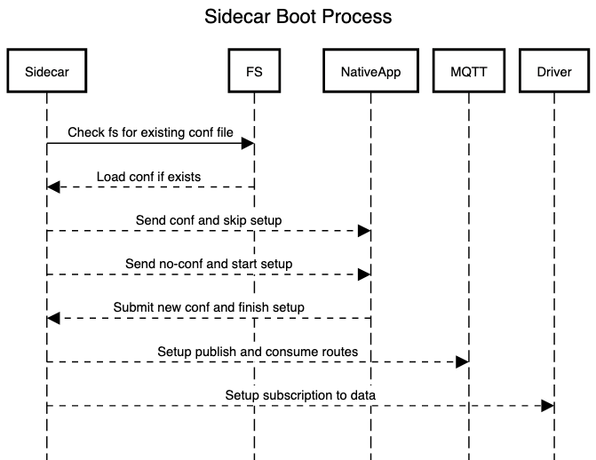

# Architecture

## Local Client / Local Sidecar

Deals with all mappings to and from the onboard system and HiveCommand language semantics

<!--  -->

## Native-App / Web-App

Bring data from backend / sidecar and display using only HiveCommand syntax