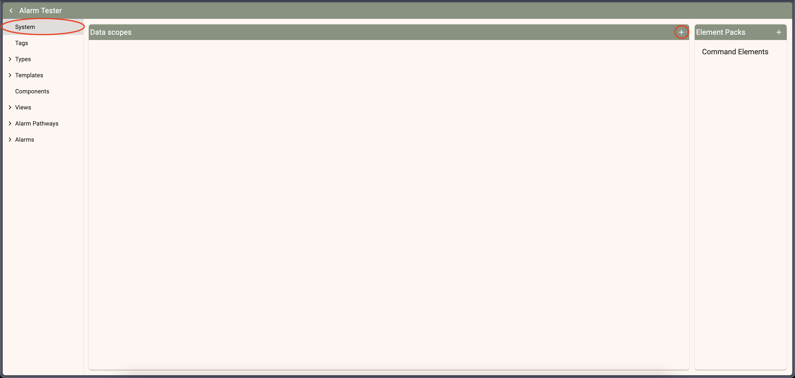
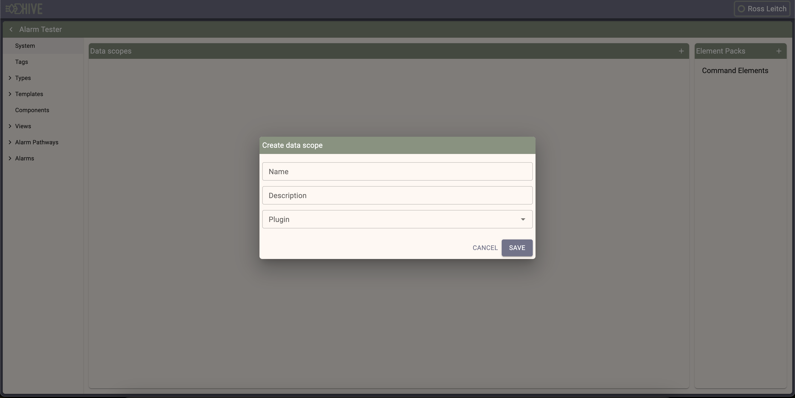
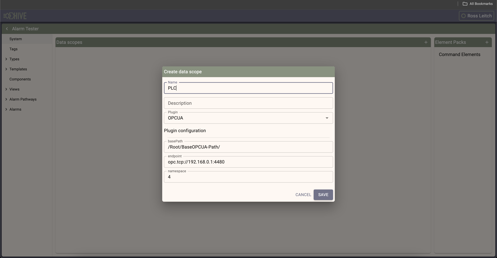
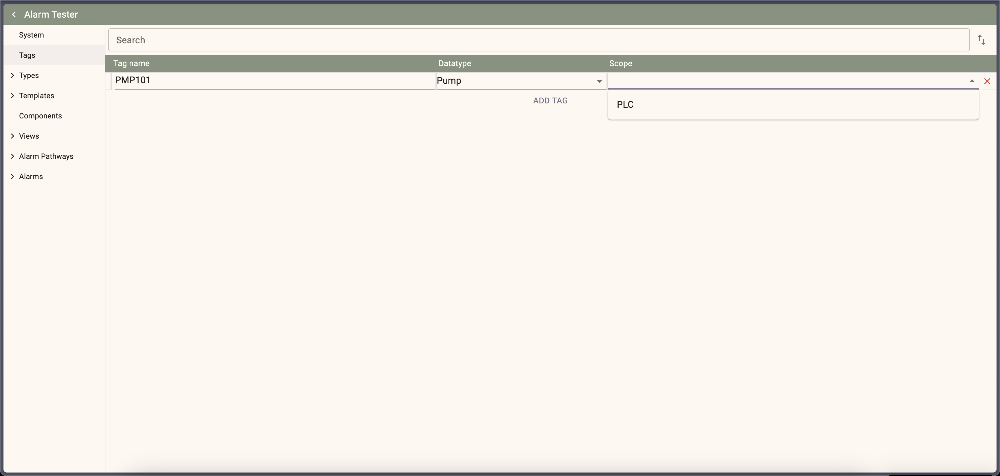
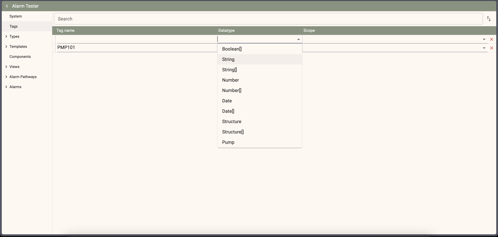

# Program IO

Communication is maintained by a series of driver libraries [(found here)](/packages/drivers/) each one is responsible for a single protocol and when instantiated is responsible for a long term connection to a single instance of the opposing server/client.

Values are included in a program through Tags and Types, Tags are top level mappings of name, datatype and location (which driver instance). Tags datatypes are basic primitives (string, number, boolean) and Types. 

Types are re-usable mappings of tags that allow for mapping logical types e.g. Valves and Pumps.

## Driver setup

To setup a new driver in a program go to the System page in the program editor and click the add button

Select the driver type from the dropdown in the modal

Finally configure the driver options to match the local configuration

## Tag setup

Tags are mapped to the local values by the drivers and each may implement this differently.

For Ethernet/IP the tags are fetched only from the global tag list and are batched in to small workloads fetched cyclicly

For OPC-UA the tags are fetched with a prefix applied from the driver configuration and are batched in to smaller workloads based on the OPC-UA serverside configuration.

Multiple different drivers can be combined through the tag list to make a new HMI top level tag list

To add new tags select Tags from the Editor menu.

Drivers can be configured from the driver dropdown on each tag row

Datatypes can be configured from the type dropdown

Changes are saved automatically as items are changed